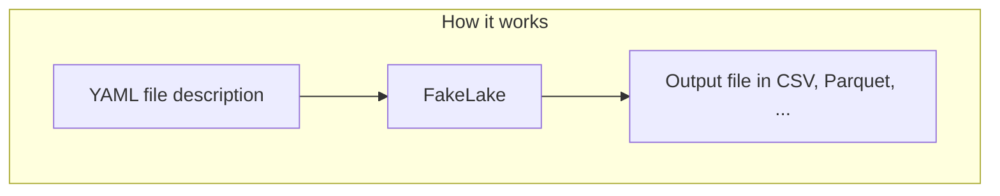

<p align="center">
  
</p>

[](https://github.com/soma-smart/Fakelake/releases)
[](https://soma-smart.github.io/Fakelake/)


<details>
  <summary>Table of Contents</summary>
  <ol>
    <li>
      <a href="#about-the-project">About The Project</a>
      <ul>
        <li><a href="#features">Features</a></li>
        <li><a href="#built-with">Built with</a></li>
        <li><a href="#benchmark">Benchmark</a></li>
      </ul>
    </li>
    <li>
      <a href="#installation">Installation</a>
      <ul>
        <li><a href="#with-precompiled-binaries">With precompiled binaries</a></li>
        <li><a href="#from-source">From source</a></li>
        <li><a href="#with-cargo">With cargo</a></li>
      </ul>
    </li>
    <li>
      <a href="#usage">Usage</a>
      <ul>
        <li><a href="#providers">Providers</a></li>
        <li><a href="#options">Options</a></li>
        <li><a href="#generation-details">Generation details</a></li>
      </ul>
    </li>
    <li>
      <a href="#contributing">Contributing</a>
    </li>
    <li>
      <a href="#license">License</a>
    </li>
  </ol>
</details><br>

# What is FakeLake ?
FakeLake is a command line tool that generates fake data from a YAML schema. It can generate millions of rows in seconds, and is order of magnitude faster than popular Python generators (<a href="#benchmark">see benchmarks</a>).

FakeLake is actively developed and maintained by [SOMA](https://www.linkedin.com/company/soma-smart/mycompany/) in Paris 🦊.


Any feedback is welcome!

## Features
- Very fast
- Easy to use
- Small memory footprint
- Small binary size
- Robust / no unsafe code
- No dependencies
- Cross-platform (Windows, Linux, Mac OS X)
- MIT license

## Built with


## Benchmark
Benchmark of FakeLake, Mimesis and Faker:<br/>
- Goal: Generate 1 million rows with one column: random string (length 10)
- Specs: Windows, AMD Ryzen 5 7530U, 8Go RAM, SSD

| Command | Mean [ms] | Min [ms] | Max [ms] | Relative |
|:---|---:|---:|---:|---:|
| `fakelake generate bench\fakelake_input.yaml` | 252.8 ± 3.3 | 249.0 | 260.0 | 1.00 |
| `python bench\mimesis_bench.py` | 3374.9 ± 21.3 | 3353.0 | 3426.2 | 13.35 ± 0.19 |
| `python bench\faker_bench.py` | 13552.7 ± 340.5 | 13336.4 | 14446.4 | 53.62 ± 1.52 |

Build the benchmark yourself with scripts/benchmark.sh

# Installation

## Simple way : With precompiled binaries

Download the latest release from [here](https://github.com/soma-smart/Fakelake/releases)

```bash
$ tar -xvf Fakelake_<version>_<target>.tar.gz
$ ./fakelake --help
```

## From source
```bash
$ git clone
$ cd fakelake
$ cargo build --release
$ ./target/release/fakelake --help
```

# How to use it
Generate from one or multiple files
```bash
$ fakelake generate tests/parquet_all_options.yaml
$ fakelake generate tests/parquet_all_options.yaml tests/csv_all_options.yaml
```
<br/>
The configuration file used contains a list of columns, with a specified <a href="#providers">provider</a> (for the column behavior), as well as some <a href="#options">options</a>.
There is also an <a href="#generation-details">info</a> structure to define the output.


```yaml
columns:
  - name: id
    provider: Increment.integer
    start: 42
    presence: 0.8

  - name: company_email
    provider: Person.email
    domain: soma-smart.com

  - name: created
    provider: Random.Date.date
    format: "%Y-%m-%d"
    after: 2000-02-15
    before: 2020-07-17

  - name: name
    provider: Random.String.alphanumeric

info:
  output_name: all_options
  output_format: parquet
  rows: 1_234_567
```

## Providers
A provider follows a naming rule as "Category.\<optional sub-category\>.provider".<br/>
Few examples:
- Person.email
- Increment.integer
- Random.String.alphanumeric

## Options
There is two types of options:
- Options linked to the provider (date and format)
- Options linked to the column (% presence)

## Generation Details
There is three optional fields:
- output_name: To specify the location and name of the output
- output_format: To specify the generated format (we support Parquet and CSV for now)
- rows: To specify the number of rows to generate

# Contributing
Contributions are welcome! Feel free to submit pull requests.

1. Fork the Project
2. Create your Feature Branch (`git checkout -b feature/AmazingFeature`)
3. Commit your Changes (`git commit -m 'Add some AmazingFeature'`)
4. Push to the Branch (`git push origin feature/AmazingFeature`)
5. Open a Pull Request

# License

Distributed under the MIT License. See `LICENSE.txt` for more information.
